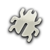

  
  

    <strong>Tarkov.community is a feedback portal for feature requests and suggestions related to Escape from Tarkov and Escape From Tarkov: Arena, forked from Fider.</strong>
   
  Special thanks to the original maintainers of <a href="https://github.com/getfider/fider">Fider</a>
  

## About Tarkov Community

**Tarkov.community** is a feedback portal for submitting feature requests and suggestions related to _Escape from Tarkov_ and _Escape From Tarkov: Arena_. This project is a fork of Fider and exists to serve the community of these games by providing a centralized place for feedback and discussion.

> This repository (Tarkov.community) is **not** designed to be self-hosted or installed independently. 
> To use the platform, simply visit [https://tarkov.community/](https://tarkov.community/).

## Contributions

We are **not currently seeking active contributors** or feature pull requests. However, if you find a bug and want to help out by submitting a fix via a pull request, we'd appreciate it!

